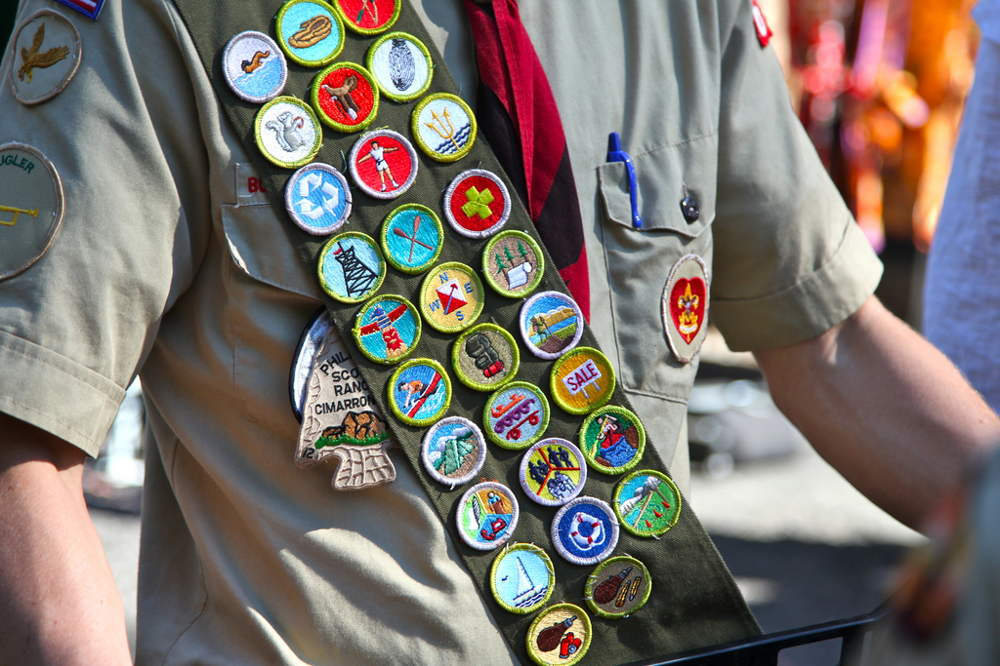
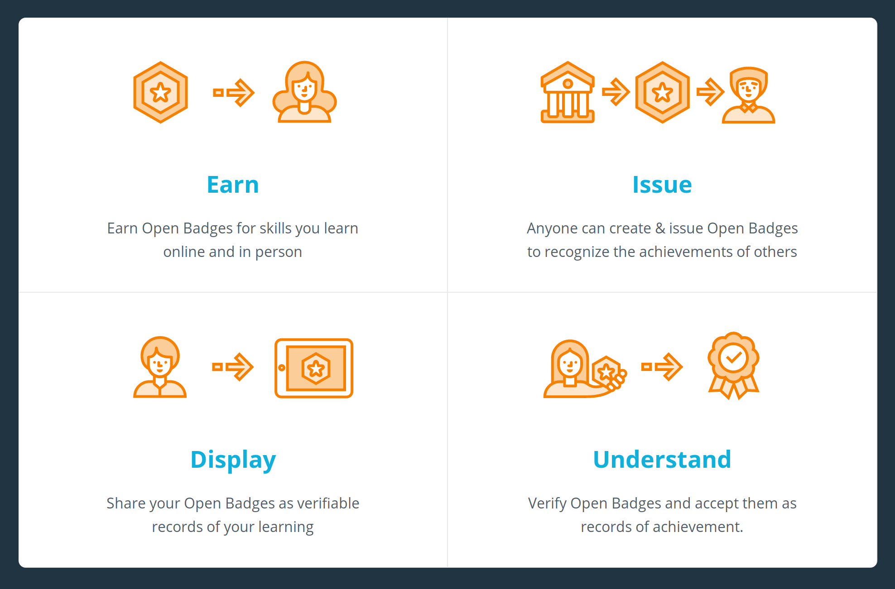
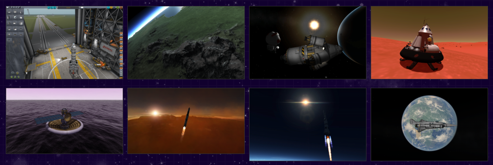
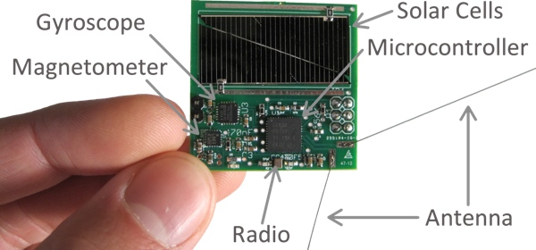
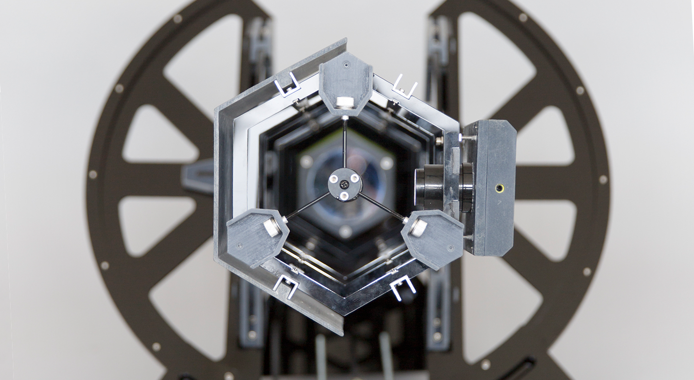
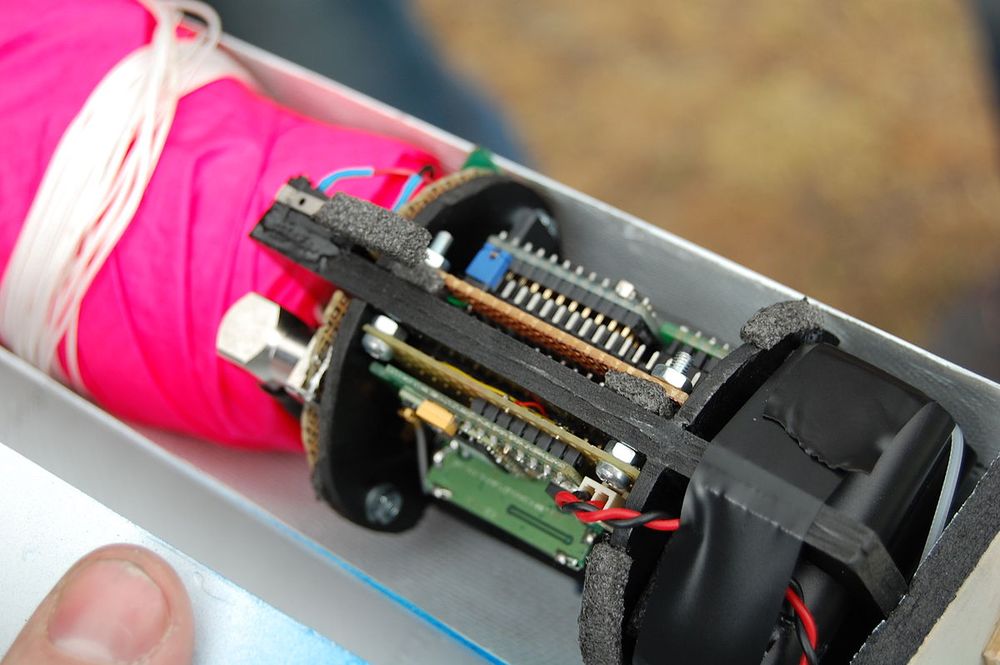
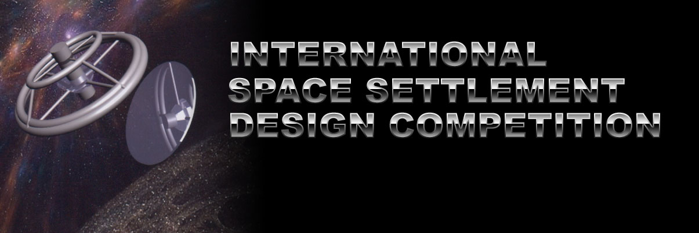

# Introduction

I'm putting together some ideas to improve aerospace education by using hands-on technologies. This is still a work in progress, and written in a very informal style. For the final version I'll rewrite it into a more formal curriculum.

I work in China sometimes, so if I reference China that's why!

# Space Education is Abstract and Theoretical

Right now, when schools teach about space it's pretty dry. Here are the planets. Here's how they were formed. Here's gravity. A bloke called Armstrong went to the Moon and brought back some rocks.

Anyone who is *naturally* interested in space might be inspired by this stuff -- but those are the people who'd rush out to find this stuff out anyway. How do we get everyone else involed? How do we make space super-interesting and accessible to the average person, and really get them involved in mankind's biggest journey?

My answer draws upon my work with SpaceGAMBIT (an open-source space program) and makerspaces, hackerspaces, and Fab Labs (a global network of workshops with a whole bunch of tools, that pretty much anyone can use)

# Let's Make Space Hands-On

Space is a big, black inky void, full of spinning balls of rock or gas. No wonder it seems abstract to many people. You can't exactly get hands-on with Saturn's rings.

But you can get hands-on with the stuff that actually gets humanity to space. And that's the most exciting stuff of all. It's all about exploring the unknown and pushing the frontiers of human achievement.

I'm all about getting my hands dirty, and I want to encourage other people to do the same. That's the only way we're ever going to get humanity to those spinning balls of rocks, and maybe live on them someday.

Luckily, there are a bunch of projects out there that let us roll up our sleeves and get involved. This course outline aims to use some of these and bash them together into some kind of logical and unified curriculum, helping participants gain skills in STE(A)M and maker education.

# Curriculum

The curriculum is broken down into different units, each focusing on different objectives and skills.

**Before each activity**: Participants create a Design Contract, in which they consider what they want to achieve, how to achieve it, how to show they've achieved it, the resources they'll need, and anything that might get in their way.

**At the end of each unit**:

* Participants present their findings and results via a presentation, short video, or document.
* After successfully completing a unit, participants are awarded with a "badge" (a physical badge *and* virtual credential) from the curriculum badge tree. (There's more information on this in the *infrastructure* section below)

| Unit | Focus | Objectives | Skills | Tools |
| --- | --- | --- | --- | --- |
| Rocket Science | Understanding rocketry and physics | <ul><li>Build a virtual rocket<li>Get rocket into specified orbit<li>Land on "Moon" and return to "Earth"</ul> | <ul><li>Orbital mechanics<li>Rocket science</ul>| [Kerbal Space Program](https://kerbalspaceprogram.com/) |
| Rocket Engineering | Competing to build the "best" rocket | <ul><li>Work in teams to design a bottle rocket<li>Model it in Kerbal Space Program and adjust as necessary<li>Build rocket<li>Launch rocket | <ul><li>Scientific method and reasoning<li>Maker skills<li>Computer simulation and modeling </ul>| <ul><li>[Kerbal Space Program](https://kerbalspaceprogram.com/)<li>[Bottle Rocket kits](http://www.instructables.com/id/How-To-Make-A-Bottle-Rocket/) |
| Astronomy | Building a telescope to view celestial bodies | <ul><li>Understand principles of optics and telescopes<li>(Team) build a telescope<li>Log celestial bodies</ul> | <ul><li>3D printing</li><li>Astronomy</li><li>Raspberry Pi/Arduino</li></ul> | <ul><li>[PiKon](https://pikonic.com/) (Elementary)</li><li>[Ultrascope](http://www.openspaceagency.com/ultrascope/) (Advanced)</li> |
| Satellites 1: Kicksats | Build and test your own satellite | <ul><li>Learn about how satellites are used</li><li>Learn about weight/power restrictions, etc</li><li>Construct a Kicksat Sprite</li><li>Program a Kicksat Sprite</li></ul> | <ul><li>Circuits</li><li>Soldering</li><li>Basic Arduino programming</li></ul> | <ul><li>[Fritzing](fritzing.org/)</li><li>[Kicksat Sprite kits](http://kicksat.github.io/)</li><li>[Arduino Create](https://create.arduino.cc/) |
| Satellites 2: Ground Stations | Coming soon | Coming soon | Coming soon | Coming soon |
| Satellites 3: Cansats | Coming soon | Coming soon | Coming soon | Coming soon |
| Satellites 3: Cubesats | Coming soon | Coming soon | Coming soon | Coming soon |
| Asteroid Prospecting | Learn about asteroids and identify interesting ones for colonization or resources | Coming soon | Coming soon | Coming soon |
| Asteroid Mining | Teams design and build a mining robot to extract resources | Coming soon | Coming soon | Coming soon |
| Settling Space | Teams design and create mockups of extra-terrestrial habitats | Coming soon | Coming soon | Coming soon |

# Infrastructure

## Badges

Everyone loves a gold star or a badge to show they've achieved something and to show off to their peers. This helps give a sense of achievement, motivates participants to aim for the next badge, and builds community.

We can integrate badges into our curriculum using the [Open Badges](https://openbadges.org/) framework, and look at building in a blockchain component to securely store achievements (which can be presented as proof of achievement to future employers or academic institutions).

## Online Platform

If we want to get a lot of people involved and build a community, we need a platform. 

* This should work worldwide, regardless of internet censorship, language, bandwidth, screen size, or computer power considerations
* For data security, this should be self-hosted and not tie into existing social media frameworks (especially if we're looking to involve kids)
* It should integrate a (very limited) social network, badging, blog, code repository and file hosting
* It should be open-source

[DIY.org](https://diy.org/) is a very nice example of what we could aim for (albeit we'd need to add a few more features)

## Offline Structure

Teachers, props, classrooms, textbooks, and so on. These are highly dependent on conditions on the ground, so let's cross that bridge when we come to it.

### Fab Labs/Hackerspaces/Makerspaces

Participants will need access to certain tools and facilities for many of the activities in the curriculum. We encourage partnering with a local Fab Lab or makerspace, to give participants exposure to the maker community and real-world tool use.

Rest of the document to come soon...

# Appendix: Cool Shiny Technologies to Get People Hooked

Really difficult stuff is often described as *rocket science*. I think that scares people about real rocket science and space in general. Space is seen as too big, too difficult, and too expensive for the Average Joe (or the Average Zhou if you're in China) to get involved.

Luckily, Joe/Zhou is wrong. Here are a bunch of tools and technologies that anyone can get involved with to really learn the nitty-gritty of space science, and/or engineering. Let's look a few of them, going from easy to less easy:

## Kerbal Space Program

[Kerbal Space Program](https://www.kerbalspaceprogram.com/) is a space flight simulation video game in which players direct a nascent space program, staffed and crewed by green humanoid aliens known as "Kerbals". The game features a realistic orbital physics engine, allowing for various real-life orbital maneuvers such as Hohmann transfer orbits and bi-elliptic transfer orbits. Kids love it.

It’s available as a discounted educational version, has Chinese language support, and allows players to build real-world machinery (including Chinese Long March rockets, etc)

**Skills:** Orbital mechanics, rocketry, general space understanding

## Kicksat

[KickSat](https://en.wikipedia.org/wiki/KickSat) was a small-satellite (femtosatellite) project inaugurated in early October, 2011, to launch a large number of very small satellites from a 3U CubeSat. The satellites have been characterized as being the size of a large postage stamp and also as "cracker size".

Kicksat reached its orbit and transmitted beacon signals that were received by radio amateurs, telemetry data allowed the prediction of the orbit and the reentry on 15 May 2014 at about 01:30 UTC. Due to a non-redundant design, a timer reset while on-orbit and the femtosatellites were not deployed in time, and burned up inside the KickSat mothership when the undeployed satellite-deployment mechanism reentered Earth's atmosphere.

All files are freely available to download, and we can work with local, small-quantity PCB suppliers (Alex knows some) to get started.

**Skills:** Circuit design, basic programming, soldering

## Ultrascope

[The Ultrascope project](http://www.openspaceagency.com/ultrascope/) is developing an open-source a kit-set telescope that would reduce the cost of pro-level astronomy by an order of magnitude.

In other words, a robot telescope - or ARO - Automated Robotic Observatory, that would allow amateur astronomers to contribute to citizen science projects for a radically reduced cost. We're still refining the performance of our first EXPLORER SERIES ULTRASCOPE - a 3.5 Inch mirror ARO that is able to conduct celestial photography and photometry. 

Alex has previously worked with the Ultrascope team for project selection, and implementing an Ultrascope in Africa to live-stream astronomy to the USA.

**Skills:** 3D printing, laser cutting, , Arduino, astronomy

## Cansat

A [CanSat](https://en.wikipedia.org/wiki/CanSat) is a type of sounding rocket payload used to teach space technology. It is similar to the technology used in miniaturized satellites. They’re much less complicated than a cubesat, and have been used mostly in education so far.

In CanSat competitions, the payload is required to fit inside the volume of a typical soda can (66mm diameter and 115mm height) and have a mass below 350g.Antennas can be mounted externally, but the diameter can't increase until the CanSat has left the launch vehicle. The CanSats are deployed from small rocket at height which varies depending on the competition. CanSats are equipped with a recovery system, usually a parachute, to limit damage upon recovery and to allow the CanSat to be reused. CanSats are used to teach space technology, because of their inexpensive price and small volume.

**Skills:** Mechanical engineering, CAD, medium level programming

## Cubesats

We all know what [Cubesats](https://en.wikipedia.org/wiki/CubeSat) are. I don’t need to explain here ;) But it also ties in very nicely with Kicksats (Kicksats are launched out of a 3U cubesat) and is a logical progression (in cost and complexity) from Cansats.

**Skills:** Systems design, radios, mission planning

## International Space Settlement Design Competition

Note: [This competition](http://www.spaceset.org/) seems to have been discontinued a few years ago. But we could potentially start a China/Asia version

This contest puts high school students in the shoes of aerospace industry engineers designing a city in space that will be a home for over 10,000 people. Student engineers demonstrate creativity, technical competence, management skills, space environment knowledge, teamwork, and presentation techniques to conquer the problems inherent in siting and designing a Space Settlement (aka Space Colony).

Each year the Competition organizers develop a new design scenario with its own special requirements. Contest teams work together to create a 40-page report that addresses the issues and communicates their ideas and designs.

**Skills:** Management skills, teamwork, presentation skills, engineering

# How Do We Put it All Together?

# Infrastructure

# Advantages

# Other People Doing Cool Stuff